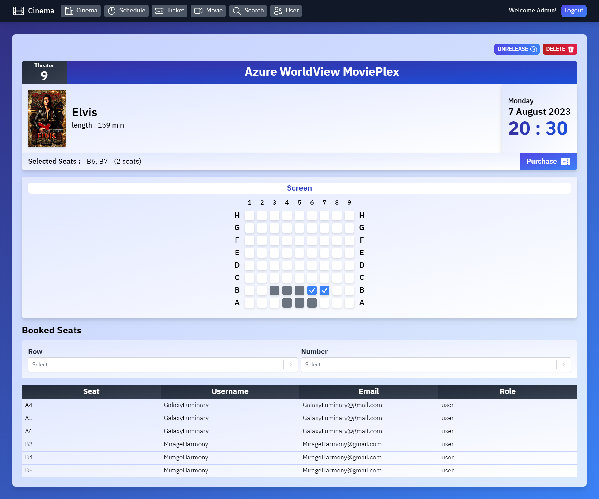
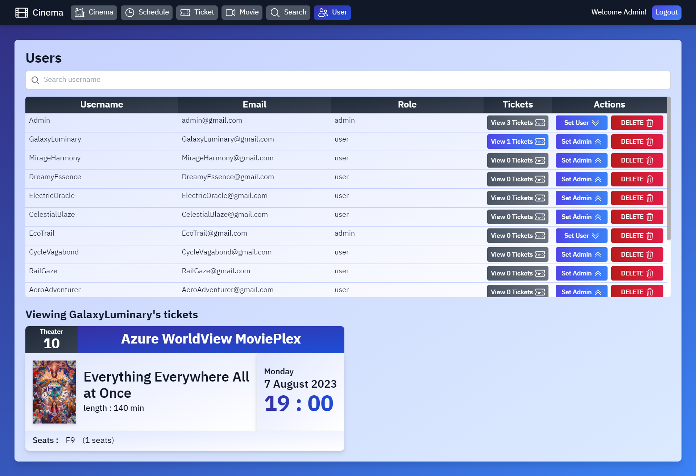

<h1 align="center">Cinema-Booking</h1>

Cinema Booking Web App with MERN stack (MongoDB, Express, React, NodeJS) & Tailwind CSS

Demo: https://cinema-booking-client.vercel.app/

## Table of Contents
* [Technologies](#technologies)
* [Screenshot](#screenshot)
* [How to run the app](#how-to-run-the-app)

## Technologies
* React 18.2.0
* React Router Dom 6.14.2
* React Hook Form 7.45.4
* Tailwind CSS 3.3.3
* Vite 4.4.8
* NodeJS
* Mongoose 7.4.2
* Express 4.18.2
* MongoDB
* And more...

## Screenshot
### Home page


### Cinema page

**For Admin**   


**For User**    


### Schedule page


### Showtime page


### Ticket page


### Movie page


### Search page


### User page


## How to run the app
1. Download the code
2. Create .env file in /server
```
PORT=8080
DATABASE=<your MongoDB connection string URI>
JWT_SECRET=<any random JWT secret>
JWT_EXPIRE=30d
JWT_COOKIE_EXPIRE=30
```
3. Start server side
```
cd server
npm install
npm start
```
4. Start client side
```
cd client
npm install
npm run dev
```
